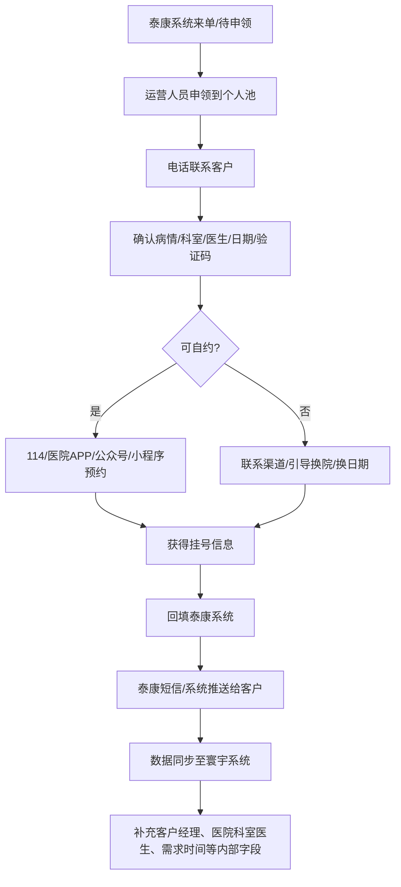
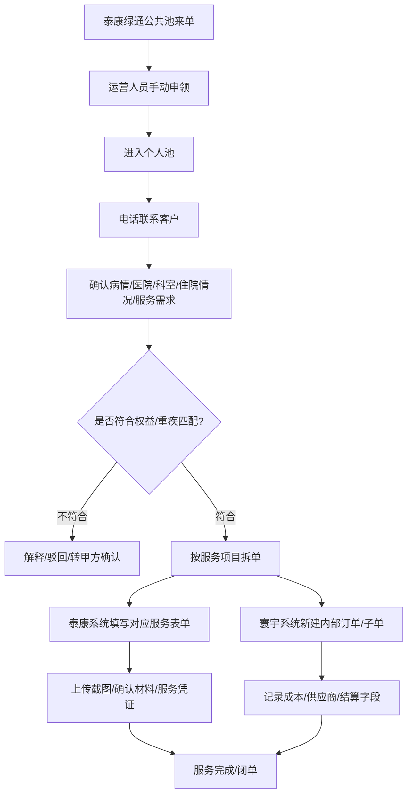
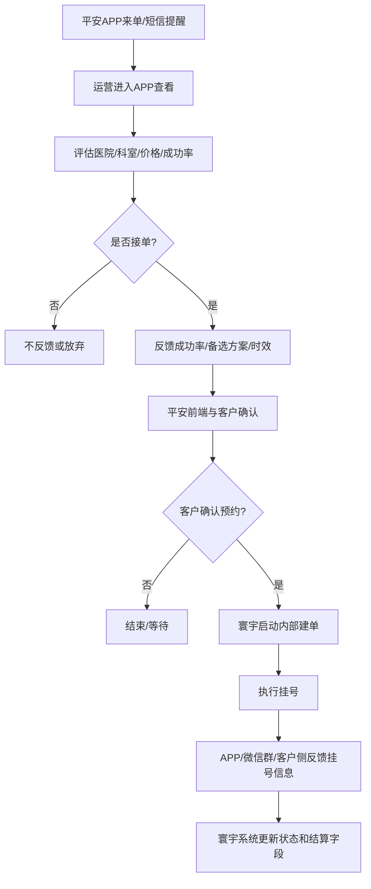
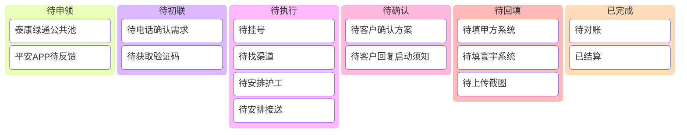

# 寰宇医道业务现状调研分析报告（完善版）
**版本：** 1.1（基于第一次业务分析报告与第二次调研纪要完善）  
**调研对象：** 寰宇运营/系统使用人员、运营管理人员  
**调研人：** 陈江波  
**业务性质：** 医疗健康服务 TPA（Third Party Administrator，第三方管理），主营医疗绿通、名医挂号及相关医疗增值服务。  
**本次完善重点：** 第二次调研相较第一次调研，宏观业务判断基本一致，但补充了大量一线岗位实际操作细节，尤其是泰康挂号/绿通、平安挂号、绿通非标服务、客户沟通留痕、截图凭证、系统重复录入与跨平台同步等内容。

---

## 0. 本次完善摘要
第一次调研已经确认：寰宇医道的业务本质是“保险公司权益履约 + 医疗资源协调 + 人工服务交付 + 复杂结算对账”。第二次调研进一步说明，当前问题并不只是“有没有系统”，而是：

1. **业务已经部分系统化，但系统之间没有打通。** 甲方系统、寰宇内部系统、微信群/企微群、医院挂号平台、滴滴/护工支付渠道之间割裂严重，员工大量时间花在复制、粘贴、回填、截图和查找上。
2. **泰康挂号与泰康绿通是两种完全不同的系统流转。** 泰康挂号在一定程度上已有接口或数据同步，通常在预约完成后才进入寰宇系统；泰康绿通则仍需员工从甲方系统申领、电话确认、手工建单并在两套系统里重复维护。
3. **绿通不是单一“陪诊”，而是几十项可枚举、慢变化的服务组合。** 包括入院接送、出院接送、护工、全程门诊、住院协调、点名服务等。一个甲方申请号下可能对应多个订单号，寰宇内部也需要拆成多张执行单。
4. **真正耗时的不是单点操作，而是“多系统 + 多角色 + 多证据 + 多状态”的持续协调。** 尤其是绿通服务中，运营人员实际上扮演了客户助理、资源调度、供应商协调、风险留痕和结算数据维护的综合角色。
5. **AI/RPA 的优先切入点应从“自动挂号”转向“工作台、结构化录入、自动回填、自动生成话术和留痕归档”。** 医院挂号平台普遍存在验证码、人脸识别、反爬与反机器人机制，直接做自动挂号投入高、持续维护成本高，且风险较大；但跨系统信息抓取、表单回填、录音提取字段、群机器人查询进度等场景更可落地。

---

## 1. 业务总体概述
北京寰宇医道（以下简称“寰宇”）主要服务于 **B 端保险公司**（甲方），为保险公司的保单客户（C 端）提供医疗增值服务。服务内容主要包括：

+ 名医挂号协助；
+ 重疾绿通；
+ 陪诊、护工、住院/出院接送、住院协调、手术/复诊安排等扩展服务；
+ 部分场景下的交通、住宿、报销提醒与服务说明。

当前业务模式属于典型的 **人力密集型 + 资源整合型 + 多方系统协同型**。其核心价值不只是“挂到号”，而是通过经验、资源、流程熟悉度和沟通能力，帮助保险客户完成医疗权益履约。

### 1.1 核心干系人
| 干系人 | 角色说明 | 当前协同方式 |
| --- | --- | --- |
| 甲方保险公司 | 订单来源方、权益规则制定方、最终结算方 | 甲方系统、APP、PC 端、微信群/企微群、在线表格 |
| C 端客户 | 实际服务对象，通常为保单客户或其家属 | 电话、企业微信、个人微信、短信、APP 确认 |
| 寰宇运营人员 | 接单、申领、电话沟通、分诊、资源协调、录单、回填、闭单 | 甲方系统、寰宇系统、电话、微信/企微、多部手机 |
| 寰宇管理/专家人员 | 处理疑难分诊、难约号源、投诉、价格/成本判断 | 人工判断、群沟通、经验决策 |
| 号源渠道/BD/黄牛 | 提供稀缺号源、特殊加号、异地资源 | 个人微信、群聊、电话、临时议价 |
| 陪诊/护工/服务商 | 提供线下陪诊、护工、接送等执行服务 | 微信、电话、医院护工中心、小程序、二维码支付 |
| 财务 | 成本支付、供应商付款、报销、对账、开票 | 寰宇系统、Excel、微信二维码、付款凭证 |

### 1.2 二次调研后的核心判断
寰宇现有系统并不是完全没有价值，而是更多承担“记账/留痕/结算基础数据”的作用，尚未真正成为运营人员每日工作的主工作台。一线员工仍然以甲方系统、微信/企微、电话、医院平台和个人经验为主线推进工作。

因此，新系统建设的重点应从“单纯替换原系统”调整为：

> 建立一个以订单/申请为中心的运营工作台，将甲方系统、寰宇系统、客户沟通、供应商协同、证据留痕和财务对账串联起来，让员工少切换系统、少重复录入、少翻聊天记录、少凭记忆判断。
>

---

## 2. 核心业务分类与服务模式
寰宇业务可归纳为两大类：**挂号业务**与**绿通业务**。两者在客户沟通深度、服务复杂度、系统录入方式、证据要求和可自动化程度上差异明显。

### 2.1 挂号业务
#### 2.1.1 定义
挂号业务是指协助客户预约指定或非指定医院、科室、专家的门诊号源。常见标准产品包括：

+ 7 天内完成服务；
+ 不点名专家；
+ 不含陪诊；
+ 只完成“约号 + 反馈挂号信息”的动作。

#### 2.1.2 当前特点
| 维度 | 业务特点 |
| --- | --- |
| 单价 | 通常较低，如部分甲方结算价约 300 元左右；点名、难约、特殊专家成本显著上升 |
| 单量 | 量大，是最基础、最标准化的服务项之一 |
| 沟通复杂度 | 低于绿通，但仍需确认病情、科室、日期、指定医生、验证码等 |
| 交付方式 | 自约、渠道约、引导换院/换医生、指导客户自约 |
| 风险点 | 约不到、客户指定医生/日期、验证码获取困难、挂号平台限制、人脸识别、客户不接电话 |
| 自动化潜力 | 表单提取、待办看板、状态回填、通知话术、进度查询可优先自动化；直接自动挂号不宜作为首期重点 |

#### 2.1.3 挂号执行方式
1. **自约**  
运营人员使用 114、医院 APP、医院公众号/小程序、京医通/医院专属平台等方式自行预约。不同医院、不同科室、不同放号时间差异较大，员工需要靠经验判断。
2. **渠道约/特殊加号**  
对于协和、北医三院、同仁、301 等热门医院或热门科室，若自约不可行，需联系号源渠道/BD/黄牛。当前约有相当比例的挂号单需要渠道介入，且一旦使用渠道，利润空间会被严重压缩，甚至可能亏损。
3. **引导换院/换医生/换时间**  
对于指定协和、指定专家、指定日期等高难度需求，运营会基于经验引导客户选择可交付且医疗水平相近的替代方案，例如从协和引导至北大人民等。
4. **指导客户自约**  
对于必须人脸识别、只能客户本人操作、绑定限制严格的平台，运营无法代操作时，会通过电话或微信一步步指导客户自行预约。

### 2.2 绿通业务
#### 2.2.1 定义
绿通业务是复杂权益包，通常围绕重疾客户或高客客户展开，可能包含：

+ 挂号；
+ 全程门诊；
+ 陪诊；
+ 入院接送；
+ 出院接送；
+ 护工服务；
+ 住院协调；
+ 手术/复诊安排；
+ 交通住宿费用说明或报销提醒；
+ 客户权益使用确认与后续投诉应对。

#### 2.2.2 二次调研新增认知
绿通并不是“挂号 + 陪诊”的简单组合，而是一个 **可枚举但高度非标的服务项目库**。服务项目虽然可以在合同或甲方系统中穷举，且变化频率不高，但每一单的实际执行方式差异很大。

例如：

+ 护工可能是 4 天、8 天、15 天等不同规格；
+ 入院接送需要确认出发地、目的地、时间、距离和车型；
+ 护工可能来自医院护工中心、护工主管、外部团队，也可能客户点名；
+ 有些服务需要水印照片、护工证、客户确认截图、滴滴截图等凭证；
+ 同一甲方申请号下可能有多个服务项目，因此会产生多个订单号，寰宇内部也要建多张执行单。

#### 2.2.3 绿通的核心特点
| 维度 | 业务特点 |
| --- | --- |
| 非标程度 | 很高。服务项目可枚举，但客户情况、医院、地区、供应商、证明材料均高度差异化 |
| 沟通强度 | 高。需要反复与客户、甲方、医院、护工/陪诊、财务沟通 |
| 拆单要求 | 强。一个申请号下可对应多个订单号，内部要按服务项目拆成多个执行单 |
| 留痕要求 | 强。截图、客户确认、启动须知、同意书、支付凭证、服务完成凭证均可能成为后续扯皮依据 |
| 结算要求 | 强。内部系统中的客户、服务项目、医院、科室等字段需与甲方系统匹配，否则影响财务付款和甲方结算 |
| 自动化潜力 | 不适合一开始做全自动交付，但适合做工作台、录音转结构化、截图归档、凭证清单、服务项目模板、状态提醒 |

---

## 3. 主要甲方接入模式与系统差异
不同甲方的接入方式、沟通限制、系统能力和对账规则差异巨大，是寰宇数字化建设的主要复杂性来源。

| 甲方 | 主要入口 | 客户沟通 | 寰宇内部系统 | 关键特点 | 自动化优先级 |
| --- | --- | --- | --- | --- | --- |
| 泰康挂号 | 泰康 PC 系统/企微群 | 电话 + 泰康企业微信；部分信息由泰康短信推送 | 预约完成后可同步进入寰宇系统，但仍需补字段 | 流程相对标准，量大，可作为首批试点 | 高 |
| 泰康绿通 | 泰康 PC 系统公共池申领 | 电话 + 泰康企业微信；需大量人工确认 | 需手工新建绿通订单/子单 | 服务项目多、表单多、截图多、结算匹配要求高 | 中高，但应先做半自动 |
| 平安 | 平安 APP，部分需人脸识别 | 多由平安客服/客户经理前置沟通；寰宇更多做交付 | 无直接接口，需人工建单 | 量大、价格低、多服务商竞争、时效窗口短 | 中，需先争取接口/管理端 |
| 人保 | 客户经理/微信/系统 | 多通过客户经理转达，客户微信限制较多 | 寰宇内部需记录 | 沟通链条长，验证码与客户确认效率低 | 中低 |
| 太保 | 企微群/在线表格 | 群内发需求，寰宇补充表格 | 寰宇内部需记录 | 甲方管理较松，表格口径易产生结算和合规风险 | 中低 |

### 3.1 泰康挂号：相对标准化，但仍存在重复回填
泰康挂号的特殊点是：**订单不一定在一开始就需要寰宇内部建单，而是在预约完成、出号后，相关数据才会同步进入寰宇系统**。但这并不意味着员工不需要操作系统。

实际流程可概括为：

#### 关键细节
1. **挂号信息需要先在泰康系统里填写。** 如果客户原需求是上午，但实际挂到下午，需要员工手动修改预约日期和时间段。
2. **医生、医院、科室主数据可能缺失。** 如果系统中没有对应医生或科室，员工需要先维护医院/科室/医生信息，保存并重置后才能继续选择。
3. **客户确认链条存在瑕疵。** 泰康系统会推送短信或 APP 方案确认，但部分客户找不到入口或收不到短信，后续出现了服务商代客户选择方案的操作。该场景需要加强电话录音或微信确认留痕。
4. **泰康企业微信是主要客户沟通工具。** 使用的是泰康身份体系，若要引入机器人或后台接口，需要泰康侧企业微信管理权限与授权。
5. **挂号业务量大但单价低。** 系统建设应优先减少重复录入和状态跟踪成本，而不是一开始就尝试替代人工沟通。

### 3.2 泰康绿通：公共池申领 + 手工建单 + 多服务拆单
泰康绿通目前是最能体现业务复杂度的场景。其核心差异是：**绿通不会像挂号一样自然同步成内部订单，需要运营人员先在泰康系统中申领，再电话确认客户需求，之后在寰宇系统中手工新建订单。**

#### 关键细节
1. **公共池申领机制。** 绿通单先进入公共池，运营人员手动申领后进入个人池。申领后其他人通常看不到或无法再申领同一单。
2. **一个申请号可能对应多个订单号。** 例如一个客户同时有入院接送、出院陪护、护工等服务，甲方侧可能是一个申请号，但下面有多个订单号；寰宇内部需要按服务项目分别建单。
3. **重疾与服务项目必须匹配。** 例如脑出血术后申请康复科或神经内科相关服务可能合理，但若申请心内科护工，则可能不符合权益要求。
4. **客户等级影响服务策略。** 泰康存在高客等级，如高客铂金/白金、钻、私钻、尊钻等。等级越高，服务要求、投诉风险和点名需求越高。
5. **很多字段只能通过电话/微信问出来。** 如住院日期、当前情况、护工到岗时间、出发地/目的地、客户能否接受替代方案等。
6. **服务凭证以截图为主。** 泰康系统暂不支持上传电话录音，闭单时更多依赖微信确认截图、滴滴订单截图、护工同意书、启动须知、护工水印照片等。
7. **寰宇系统的主要作用是成本、付款和结算。** 甲方侧需要截图作为服务证明；寰宇侧更关心订单号、服务项目、医院科室、供应商成本、财务支付和结算匹配。

### 3.3 平安：APP 接入、低价大单量、多服务商竞争
平安挂号业务量大，但流程与泰康差异明显。

#### 当前特点
+ 主要通过平安 APP 操作，部分场景每天首次登录需人脸识别；
+ 平安有自己的前端客服/客户经理，寰宇通常不直接承担完整客户沟通；
+ 寰宇需要判断能否接单，并反馈可行方案、成功率、时间范围、备选医院等；
+ 平安可能存在多服务商分发机制，某一服务商在限定时间内未响应，订单会流转到其他服务商；
+ 低价标准挂号单较多，若客户指定高难医院/科室，寰宇可能因成本过高而不接。

#### 信息化启示
平安不宜首期就做深度自动化，原因是 APP 化、人脸识别、接口不明确、服务商机制复杂。但平安量大，长期应争取：

+ PC 管理端或接口；
+ 来单抓取；
+ 方案反馈模板化；
+ 成功率/推荐替代医院辅助判断；
+ 低价高难度订单自动预警；
+ 接单后自动在寰宇系统生成草稿单。

### 3.4 人保与太保：弱系统化、强人工/表格协同
#### 人保
人保更接近平安的“客户经理中转”模式。寰宇通常不直接加客户微信，而是把可行方案、服务安排、验证码沟通等通过客户经理传递。该模式下客户确认链条长，响应慢，但甲方对客户联系方式控制更强。

#### 太保
太保更多通过企微群或在线表格来流转需求，甲方会在群里发客户信息或需求，寰宇再补充表格。该模式的问题是：

+ 需求信息散落在群聊；
+ 在线表格既是执行台账又是对账依据；
+ 甲方字段录入不完整，寰宇需要补填；
+ 存在档位、点名、服务等级口径不清的结算风险。

信息化上，应避免利用甲方管理松散进行人为“调档”，而应建立内部口径：客户实际权益、服务实际发生、甲方结算口径、内部成本口径必须留痕并可追溯。

---

## 4. 业务全流程详解
### 4.1 订单/申请接入
当前订单接入并非单一入口，而是多入口并存：

+ 甲方 PC 系统；
+ 甲方 APP；
+ 甲方企微群/微信群；
+ 甲方客户经理私聊；
+ 在线表格；
+ 短信提醒；
+ 寰宇内部群转发。

系统设计上，必须区分：

| 概念 | 说明 |
| --- | --- |
| 申请号 | 甲方侧的权益申请主编号，可能包含多个服务项目 |
| 甲方订单号 | 甲方系统中具体服务项目的订单编号 |
| 寰宇订单号 | 寰宇内部为执行、成本、结算建立的订单编号 |
| 子任务/服务项 | 挂号、陪诊、护工、接送等具体执行任务 |
| 线索单 | 尚未正式建单但已发生沟通或评估的潜在订单 |

建议新系统中明确建立：

> 甲方申请号 : 甲方订单号 : 寰宇订单号 : 服务任务 = 1 : N : N : N 的映射关系。
>

### 4.2 客户初联与需求确认
客户沟通以电话为主，后续视甲方规则加企业微信或个人微信。

#### 挂号业务常问信息
+ 是否本人申请；
+ 病情/症状；
+ 目标医院；
+ 目标科室；
+ 是否指定医生；
+ 是否指定日期或时间段；
+ 是否接受替代医院/医生/日期；
+ 是否需要验证码、账号密码、挂号平台登录信息；
+ 出号后如何接收挂号信息。

#### 绿通业务常问信息
+ 当前疾病和诊断情况；
+ 是否符合重疾权益范围；
+ 当前就诊医院、科室、医生；
+ 是否已住院、拟住院日期、出院日期；
+ 需要哪项服务：接送、护工、陪诊、全程门诊等；
+ 入院/出院接送的出发地、目的地、时间、距离；
+ 护工服务天数、是否点名、何时到岗；
+ 是否知晓启动须知、同意书、权益限制；
+ 是否存在交通住宿报销、剩余权益、取消权益等后续风险点。

### 4.3 分诊与权益匹配
第一次调研已经提出 AI 分诊需求。第二次调研进一步说明，分诊不是纯医学判断，还包括：

+ **疾病与权益匹配：** 是否符合重疾服务范围；
+ **疾病与科室匹配：** 如脑出血术后可对应康复科/神经内科；
+ **服务与场景匹配：** 护工、陪诊、接送是否与客户当前状态匹配；
+ **医院与成本匹配：** 是否能约上、是否需要渠道、是否会亏损；
+ **客户等级与服务策略匹配：** 高客投诉风险更高，需更谨慎留痕。

### 4.4 资源调度与执行
#### 挂号资源调度
+ 114；
+ 医院 APP/公众号/小程序；
+ 京医通/区域平台；
+ 客户本人平台账号；
+ 渠道/BD/黄牛；
+ 内部经验人员。

实际操作中，员工可能需要多部手机，因为不同平台绑定微信、手机号或客户账号，且部分小程序存在解绑次数限制、人脸识别限制。

#### 绿通资源调度
+ 当地陪诊团队；
+ 医院护工中心；
+ 护工主管；
+ 当地滴滴/专车/商务车；
+ 异地医院资源；
+ 内部熟悉疑难资源的负责人。

绿通服务很难简单交接，因为每个订单有大量上下文，谁接单谁掌握客户沟通、供应商承诺、价格谈判、时间安排和风险点。

### 4.5 服务凭证与闭单
当前闭单证据主要包括：

| 服务类型 | 可能需要的凭证 |
| --- | --- |
| 挂号 | 挂号条/挂号成功截图、医院/科室/医生/时间、客户通知截图 |
| 入院/出院接送 | 滴滴/专车订单截图、金额截图、出发地/目的地、距离、时间 |
| 护工 | 护工同意书/启动须知、客户微信确认截图、护工证、上岗水印照片、结束水印照片 |
| 陪诊 | 陪诊员信息、到场照片、服务完成证明、客户反馈 |
| 绿通综合服务 | 客户确认、服务安排截图、甲方系统截图、内部订单状态 |

需要注意的是：甲方系统侧更关注“证明服务发生”；寰宇内部系统更关注“用于付款和结算的结构化字段”。因此新系统应将“证据文件”和“结算字段”分开管理，但通过订单/服务任务关联。

### 4.6 投诉与追溯
绿通比挂号更容易出现多年后投诉或追溯，原因包括：

+ 客户认为医生没有解决问题；
+ 交通住宿费未报销成功；
+ 客户认为权益未用完或被取消；
+ 甲方分支或 9522 渠道转来投诉；
+ 客户多年后重新找到原运营人员。

当前追溯依赖微信聊天记录、语音通话记录、系统截图和员工记忆。建议系统建立“投诉追溯包”：一键查看订单基本信息、甲方申请号、客户沟通记录、关键截图、录音摘要、服务完成凭证、费用与结算记录。

---

## 5. 关键业务痛点
### 5.1 多系统重复录入
同一信息需要在甲方系统、寰宇系统、微信群/企微群、在线表格之间反复录入。尤其是泰康绿通和平安 APP 场景，员工经常需要复制订单号、姓名、医院、科室、医生、时间、服务项目等字段。

### 5.2 主数据不统一
医院、科室、医生存在大量别名、缺失和不同系统口径：

+ 甲方系统中有，但寰宇系统中没有；
+ 寰宇系统中有医院，但没有科室或医生；
+ 同一医院不同叫法；
+ 外地医院和医生主数据缺失率高；
+ 新增后需要保存、重置再回到订单中选择。

这导致员工明明完成了业务判断，却仍要花大量时间维护基础数据。

### 5.3 沟通留痕散落
客户确认、服务说明、风险告知、投诉证据散落在：

+ 电话录音；
+ 泰康企微；
+ 个人微信；
+ 甲方群；
+ 内部群；
+ 截图；
+ 甲方系统附件；
+ 员工手机。

这些资料在交接、审计、投诉、结算时难以完整还原。

### 5.4 绿通服务非标，无法简单自动化
绿通的难点不是表单本身，而是服务执行过程高度非标：

+ 要和客户确认；
+ 要和医院/护工/陪诊/司机协调；
+ 要判断客户诉求是否合理；
+ 要平衡成本、体验和权益规则；
+ 要在未来投诉时证明自己已经尽到提醒义务。

因此绿通不能简单做成全自动机器人，而应做“人机协同”：AI 辅助提取、提醒、生成话术、检查凭证，人仍然负责复杂判断和情绪沟通。

### 5.5 低价挂号单利润薄，渠道成本高
部分甲方标准挂号单价格低，而热门医院/热门科室的渠道成本可能高于结算价。一旦需要黄牛或特殊渠道，订单可能基本不赚钱甚至亏损。

系统需要在接单阶段就提示：

+ 该医院/科室是否高难；
+ 是否历史上经常需要渠道；
+ 预计渠道成本；
+ 是否低于毛利底线；
+ 是否建议引导替代医院/医生。

### 5.6 工作优先级依赖人工经验
一线员工同时面对挂号、绿通、客户投诉、甲方询单、供应商反馈、验证码、打车、护工到岗等事项。当前优先级主要靠经验判断，容易遗漏。

建议显式建立优先级规则：

1. 投诉与重大客户风险；
2. 当日/次日服务交付；
3. 高客/尊钻等高等级客户；
4. 绿通进行中服务；
5. 即将放号/验证码时效强的挂号任务；
6. 普通挂号反馈与信息补录；
7. 历史资料补齐与对账数据维护。

---

## 6. 数字化与 AI/RPA 介入机会
### 6.1 建设统一运营工作台
这是最优先的基础能力。工作台应替代员工在多个系统和群里来回查找的工作方式。

#### 核心功能
+ 我的待办；
+ 公共池/待申领订单；
+ 今日需联系客户；
+ 今日需抢号/放号提醒；
+ 今日需接送/护工到岗；
+ 待客户确认；
+ 待上传凭证；
+ 待闭单；
+ 待财务付款；
+ 待甲方结算；
+ 投诉/风险单置顶。

#### 看板阶段示例

### 6.2 跨平台数据同步机器人
第二次调研明确提出“跨平台数据同步”需求。建议优先做：

1. **泰康 PC 系统 → 寰宇系统**  
抓取申请号、订单号、姓名、手机号、服务项目、医院、科室、医生、时间、客户等级等，自动生成寰宇系统草稿单。
2. **寰宇系统 → 泰康 PC 系统**  
对已经结构化的信息，辅助回填预约结果、服务时间、陪诊/护工信息、截图附件清单等。
3. **甲方群机器人查询**  
甲方在群里 @机器人 + 申请号/订单号，可自动返回当前负责人、状态、预计完成时间、是否待客户确认等。
4. **内部群消息结构化**  
将群里的“启动服务”“挂号完成”“客户确认”“投诉追溯”等消息自动归档到订单时间线。

注意：如果机器人运行在泰康企业微信或甲方企业微信中，需要甲方授权 AppKey、Token、回调地址等，不能只由寰宇单方面决定。

### 6.3 电话录音转结构化字段
不建议首期用 AI 直接代替运营给客户打电话。更可行的是：

1. 人工电话沟通；
2. 自动保存录音；
3. 语音转文字；
4. AI 提取结构化字段；
5. 系统生成草稿；
6. 运营确认后提交。

#### 可提取字段
+ 客户诉求；
+ 疾病/病情摘要；
+ 医院、科室、医生；
+ 指定日期/可接受时间范围；
+ 是否接受替代方案；
+ 入院/出院地址与时间；
+ 护工天数、到岗时间、是否点名；
+ 风险告知是否完成；
+ 客户是否确认启动须知/服务方案。

### 6.4 服务项目模板与凭证清单
针对绿通几十项服务，应建立服务项目字典。每个服务项目配置：

+ 适用甲方；
+ 服务名称；
+ 规格，如 4 天/8 天/15 天；
+ 必填字段；
+ 需要客户确认的话术；
+ 需要上传的截图/附件；
+ 是否需要财务付款；
+ 是否需要供应商；
+ 结算字段；
+ 常见风险提示。

示例：

| 服务项目 | 必填字段 | 凭证 | 风险点 |
| --- | --- | --- | --- |
| 入院接送 | 出发地、目的地、时间、距离、车型、乘车人手机号 | 滴滴/专车订单截图、金额截图 | 超 30 公里、天气影响、司机接单慢、客户等待 |
| 护工 | 医院、科室、天数、到岗时间、护工来源、价格 | 启动须知、客户同意截图、护工证/水印照片 | 护工未到岗、天数超权益、客户未确认 |
| 挂号 | 医院、科室、医生、日期、平台、是否点名 | 挂号条/电子截图 | 医生错误、时间错误、客户未收到短信 |

### 6.5 医院/科室/医生主数据治理
建立统一主数据中心，解决“查不到、新建、重置、再返回”的低效问题。

#### 建议字段
+ 医院标准名称；
+ 医院别名；
+ 地区/城市/区县；
+ 医院地址；
+ 医院等级；
+ 可预约平台；
+ 放号规则；
+ 是否需要验证码；
+ 是否需要人脸识别；
+ 科室标准名称与别名；
+ 医生姓名、职称、擅长方向；
+ 预约难度等级；
+ 渠道依赖程度；
+ 历史平均成本；
+ 可替代推荐医院/医生。

### 6.6 渠道/BD 询价助手
对黄牛/BD 的自动化不应直接替代人工决策，而应先做“询价和信息收集”。

可实现：

+ 根据医院/科室/医生自动推荐可询渠道；
+ 一键生成标准询价消息；
+ 批量发送给多个渠道或提醒人工逐个发送；
+ 自动收集报价、时效、成功率；
+ 显示历史靠谱度；
+ 由人最终选择。

不建议系统自动下单给某个渠道，因为渠道承诺不稳定、报价可能临时变化，且存在灰色合规风险。

### 6.7 价格与利润预警
系统应支持多套价格表（Price Book）和成本预警。

#### 预警示例
+ 甲方结算价 300 元，但该医院/科室历史渠道成本 500-800 元，提示“高亏损风险”；
+ 客户指定专家且要求点名，提示“标准权益可能不覆盖”；
+ 高客客户要求特殊医生，提示“需主管确认是否接受亏损履约”；
+ 平安低价单若成功率低于阈值，建议放弃或提供替代方案。

### 6.8 投诉追溯与风险留痕
建议每张订单形成自动时间线：

+ 来单时间；
+ 申领人；
+ 首次联系时间；
+ 通话录音摘要；
+ 客户确认内容；
+ 服务方案；
+ 替代方案；
+ 风险告知；
+ 服务凭证；
+ 甲方系统回填时间；
+ 寰宇系统回填时间；
+ 财务付款；
+ 结算状态；
+ 投诉记录。

这样在两三年后客户投诉时，不需要运营人员翻个人微信和旧手机。

---

## 7. 建议系统能力清单
### 7.1 核心对象模型
| 对象 | 说明 |
| --- | --- |
| 甲方 | 保险公司及其分支机构、客户经理、价格表、权益规则 |
| 客户 | C 端服务对象，含联系方式、甲方身份、客户等级 |
| 申请 | 甲方侧一次权益申请，可包含多个订单 |
| 订单 | 寰宇内部执行与结算单位 |
| 服务任务 | 挂号、护工、接送、陪诊等最小执行单元 |
| 医院/科室/医生 | 主数据与预约难度、成本标签 |
| 供应商/渠道 | 黄牛、BD、陪诊、护工、司机/平台等 |
| 沟通记录 | 电话、微信、企微、群消息、短信、录音摘要 |
| 凭证 | 截图、挂号条、同意书、照片、水印照片、支付凭证 |
| 费用 | 渠道成本、护工费用、车费、财务付款、沉没成本 |
| 结算 | 甲方结算单、发票、回款、差额、调整 |
| 投诉 | 投诉来源、诉求、证据包、处理结果 |

### 7.2 关键功能模块
1. **订单接入与草稿单生成**
2. **公共池/个人池/申领管理**
3. **运营工作台/看板**
4. **客户电话录音与 AI 摘要**
5. **服务项目模板与自动拆单**
6. **甲方系统 RPA/接口同步**
7. **医院/科室/医生主数据中心**
8. **渠道询价与成本记录**
9. **客户通知话术生成**
10. **截图/凭证上传与完整性校验**
11. **财务付款申请与供应商费用关联**
12. **甲方结算映射与对账**
13. **投诉追溯证据包**
14. **经营分析与利润预警**

---

## 8. 分阶段实施建议
### 阶段一：流程梳理与数据字典（建议先做）
目标：把系统要自动化的对象和字段定义清楚。

交付物：

+ 甲方系统字段清单；
+ 寰宇系统字段清单；
+ 泰康挂号 SOP；
+ 泰康绿通 SOP；
+ 平安挂号 SOP；
+ 服务项目字典；
+ 凭证清单；
+ 医院/科室/医生主数据规范；
+ 订单状态与看板阶段定义。

### 阶段二：泰康挂号试点
原因：

+ 流程相对标准；
+ 单量较大；
+ 已有一定系统同步基础；
+ 沟通复杂度低于绿通；
+ 更容易验证提效价值。

建设内容：

+ 泰康 PC 端订单抓取；
+ 寰宇系统草稿单/字段补全；
+ 挂号结果回填辅助；
+ 客户通知模板；
+ 甲方群/内部群进度查询；
+ 今日待挂号看板。

### 阶段三：泰康绿通半自动化
目标不是全自动交付，而是降低重复录入和漏凭证风险。

建设内容：

+ 绿通公共池待办；
+ 电话录音结构化；
+ 服务项目自动拆单；
+ 不同服务项目表单模板；
+ 截图/凭证完整性检查；
+ 护工/接送/陪诊成本记录；
+ 投诉追溯包。

### 阶段四：平安 APP 与多甲方扩展
在泰康试点稳定后，再处理平安和其他甲方。

建设内容：

+ 平安 APP 来单抓取可行性评估；
+ 争取 PC 管理端或接口；
+ 成功率/替代方案反馈模板；
+ 多服务商时效窗口提醒；
+ 低价订单成本预警；
+ 人保/太保在线表格与群消息结构化。

### 阶段五：经营分析与对账自动化
建设内容：

+ 甲方结算单导入；
+ 申请号/订单号/寰宇订单映射；
+ 服务项目与价格表匹配；
+ 供应商成本自动关联；
+ 利润核算；
+ 历史欠款与坏账追踪；
+ 调整单、补单、拆单留痕。

---

## 9. 不建议首期投入的方向
### 9.1 不建议一开始做“全自动挂号”
原因：

+ 114、医院 APP、公众号、小程序存在验证码、滑块、人脸识别、绑定次数限制；
+ 医院平台反自动化策略持续变化；
+ 不同医院差异大，维护成本高；
+ 一旦被风控，可能影响业务账号；
+ 投入产出比不如先做信息同步和工作台。

### 9.2 不建议一开始用 AI 全自动打电话处理绿通
原因：

+ 绿通客户通常病情复杂、情绪敏感、诉求多变；
+ 高客客户对服务体验要求高；
+ 涉及权益解释、风险告知、投诉预防；
+ AI 话术容易降低客户满意度；
+ 更适合先做人打电话、AI 提取字段和生成摘要。

### 9.3 不建议把黄牛/BD 自动下单完全交给机器人
原因：

+ 报价和承诺不稳定；
+ 存在临时涨价、失败、爽约风险；
+ 需要结合历史可靠度、客户等级和利润判断；
+ 应由系统辅助询价和汇总，人做最终判断。

---

## 10. 结论
第二次调研验证了第一次报告的总体判断：寰宇医道的核心问题不是单一系统缺失，而是 **非标医疗服务业务在多甲方、多系统、多沟通工具、多供应商、多证据链下缺少统一运营中台**。

更准确地说，寰宇当前的数字化建设重点应是：

> 以订单/申请为中心，建立“运营工作台 + 数据同步 + 服务任务拆解 + 沟通留痕 + 凭证归档 + 成本结算”的一体化系统，而不是一开始追求完全替代人工沟通或自动挂号。
>

优先落地路径建议为：

1. 先梳理字段、状态、服务项目和凭证要求；
2. 以泰康挂号为首个自动化试点；
3. 再扩展到泰康绿通的半自动化拆单、回填和凭证校验；
4. 同步建设主数据、价格表和工作台；
5. 最后再逐步处理平安 APP、人保/太保弱系统化流程和复杂对账。

如果系统按此路径建设，短期可以减少一线员工重复录入、翻群、补字段和漏凭证；中期可以提升订单履约效率、降低投诉追溯成本；长期可以帮助寰宇建立真正的医疗服务履约数据资产和利润核算能力。

